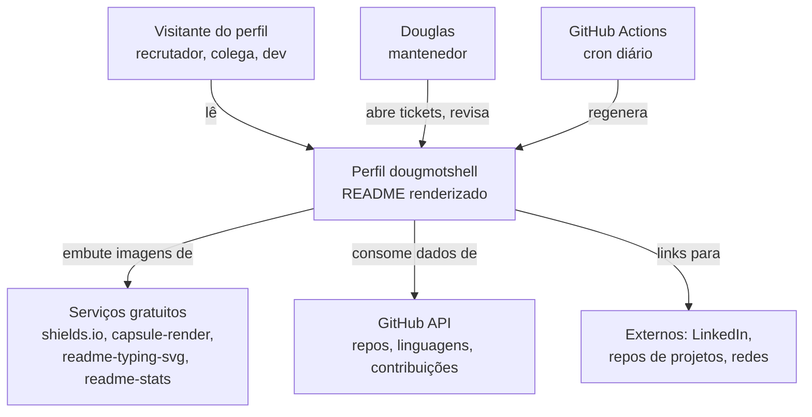
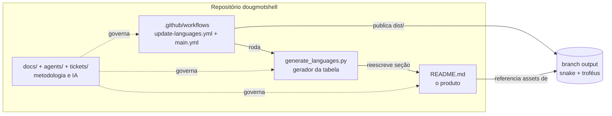
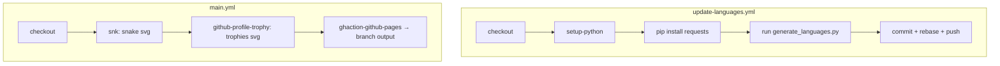

# Modelo C4 do Perfil GitHub `dougmotshell`

Adaptação do [modelo C4 de Simon Brown](https://c4model.com/) (Context, Containers, Components, Code) para descrever este repositório de perfil — o **overview do usuário** renderizado em https://github.com/dougmotshell — em 4 níveis de zoom.

| Nível | Em software | Aqui | Pergunta que responde |
|---|---|---|---|
| 1. Contexto | Sistema e atores externos | O perfil e quem/o que interage com ele | "O que é e com o que se conecta?" |
| 2. Contêineres | Aplicações/serviços | Grandes blocos do repositório | "De quais partes é feito?" |
| 3. Componentes | Módulos internos | Seções do README + peças da automação | "Do que cada bloco é feito?" |
| 4. Código | Classes/funções | Scripts, workflows e o contrato dos marcadores | "Como executa, concretamente?" |

---

## Nível 1 — Contexto

**Atores e dependências externas:**

- **Visitante** — o "usuário" real; consome o perfil nos dois temas do GitHub, em desktop e mobile.
- **GitHub API** — fonte dos dados dinâmicos (linguagens por bytes, stats, grafo de contribuição, snake, troféus).
- **Serviços gratuitos de terceiros** — geram as imagens/animações ([ADR-0004](../adr/0004-zero-cost-external-services.md)); risco: indisponibilidade/cache de CDN.
- **GitHub Actions** — o "processo em background" que mantém o perfil atualizado sem intervenção.

## Nível 2 — Contêineres

| Contêiner | Responsabilidade | Dono ([agentes](../../agents/README.md)) |
|---|---|---|
| `README.md` | O perfil renderizado (produto) | content-writer (texto) + readme-designer (visual) |
| `generate_languages.py` | Agrega linguagens e reescreve a seção entre marcadores | automation-engineer |
| `.github/workflows/` | CI: atualização diária de linguagens, snake e troféus | automation-engineer |
| `docs/` + `agents/` + `tickets/` | Metodologia (C4/ADR/spec) e fluxo de agentes de IA | docs-writer + tech-lead |

## Nível 3 — Componentes

**Seções do `README.md`** (ordem de renderização): header wave → typing SVG → profile views/followers → About Me → Featured Projects → GitHub Stats → Streak → Trophies → Tech Stack → Contribution Activity → Snake → Connect → **Most Used Languages (auto)** → footer wave.

**Peças da automação:**

## Nível 4 — Código e protocolos

- **Contrato dos marcadores** ([ADR-0002](../adr/0002-auto-generated-language-badges.md)): `generate_languages.py` reconstrói o README como `split(START)[0] + "\n" + tabela + split(END)[-1]`. Invariante: **exatamente um** par `<!-- LANGUAGES-START -->` / `<!-- LANGUAGES-END -->`.
- **Agregação**: `Counter` soma bytes por linguagem em todos os repos públicos não-fork; `most_common()` ordena; `LANG_CONFIG` mapeia cor/logo/logoColor por linguagem (default cinza `555555`).
- **Paridade de temas** ([ADR-0003](../adr/0003-light-dark-theme-parity.md)): cada recurso visual é um `<picture>` com `<source media="(prefers-color-scheme: dark|light)">` + `` fallback.
- **Agendamento**: ambos os workflows em cron `0 0,12 * * *` + `workflow_dispatch`; segredo único `GITHUB_TOKEN`.
- **Protocolos de trabalho**: mudanças no perfil seguem o [handoff-protocol](../../agents/handoff-protocol.md) via [tickets](../../tickets/README.md); validação pela skill [`/readme-check`](../../.claude/skills/readme-check/SKILL.md).
